## 一、棋盘覆盖问题

### 1.1 问题描述

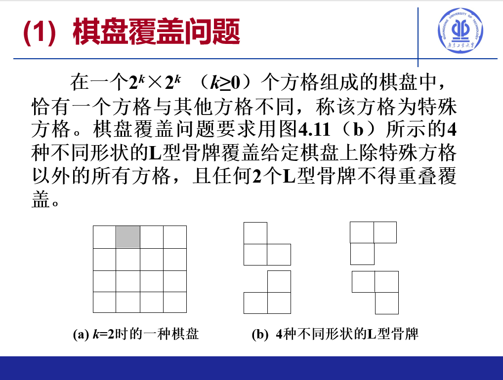

### 1.2 算法思想

​		采用分治思想，采用自顶向下的方式，将棋盘分为特殊方格所在区块以及普通区块共四个区块，之后在三个普通区块交汇处放置L型骨牌，此时问题变为各个区块内部的棋盘覆盖问题，采用自顶向下的方式，最下层的2x2区块仅有一个特殊方格，也按区块角度放置L型骨牌后区块即完成填充。

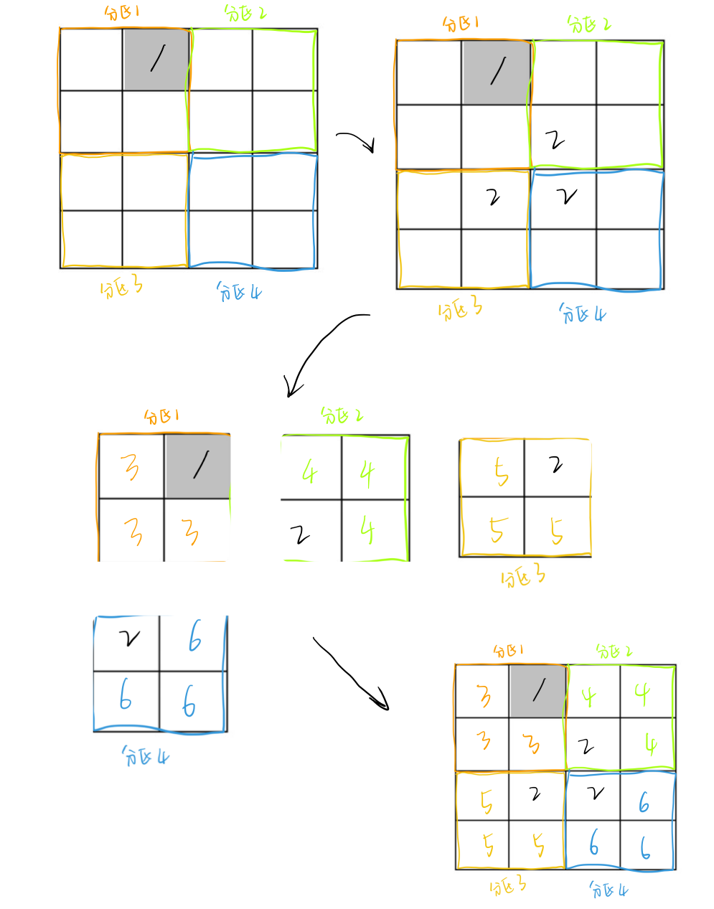

### 1.3 实现

```java
// 定义点
class myPoint {
    int x, y;

    public myPoint(int x, int y) {
        this.x = x;
        this.y = y;
    }
}

public class Main {
    // 定义填充的数字，一开始的特殊方格为1，后来在区块交界处放置L型骨牌，初始填充数字为2
    static int currentNumber = 2;

    public static void main(String[] args) {

        // 校验输入长度
        int n = -1;
        while (n == -1) {
            System.out.print("输入矩阵的边长(2^n, n in 0...10), n: ");
            Scanner scanner = new Scanner(System.in);
            n = scanner.nextInt();
            if (n < 0 || n > 10) {
                n = -1;
            }
        }
        
        // 转换为棋盘的长度（2^n）
        int len = n == 0 ? 1 : 2 << (n - 1);
        
        // 校验输入坐标
        int[][] board = new int[len][len];
        int x = -1, y = -1;
        while (x == -1 || y == -1) {
            System.out.print("输入特殊方格的坐标(x, y): ");
            Scanner sc = new Scanner(System.in);
            x = sc.nextInt();
            y = sc.nextInt();
            if (x < 0 || x > len - 1 || y < 0 || y > len - 1) {
                x = -1;
                y = -1;
                System.out.println("请确认输入的坐标有效！ 0<=x,y<" + len);
            }
        }
        
        // 打印输入坐标
        System.out.println("矩阵的边长为"+ len);
        
        // 设置特殊方格为输入坐标
        myPoint mutatedPoint = new myPoint(x, y);
        
        // 执行棋盘覆盖
        int[][] res = chessBoard(len, mutatedPoint, board);
        
         // 输出结果
        System.out.println("    y");
        for (int i = 0; i < len; i++) {
            System.out.printf("%4d|",i);
            for (int j = 0; j < len; j++) {
                System.out.printf("% 6d", res[i][j]);
            }
            System.out.println("");
        }
 
        Scanner scanner = new Scanner(System.in);
        System.out.print("按任意键退出");
        scanner.next();
    }

    static int[][] chessBoard(int len, myPoint mutatedPoint, int[][] board) {
		
        if (len == 1) {
            board[0][0] = 1;
            return board;
        }
		
        //  填充棋盘中的特殊方格
        board[mutatedPoint.y][mutatedPoint.x] = 1;
        
        // 递归执行棋盘覆盖算法
        helper(0,len-1,0,len-1,mutatedPoint, board);
        return board;
    }

	// 填充棋盘算法，定义了填充方向如下（由特殊方格所在区块的边界点为basePoint）
    // 假设此时特殊方格所在的点为3，则其填充方向为0
    //              -----
	//              |0|1|
	//              _____
	//              |2|3|
    //              -----
    static void fill(myPoint basePoint, int fillDirection, int[][] board) {
        switch (fillDirection) {
            case 0: {
                board[basePoint.y][basePoint.x - 1] = currentNumber;
                board[basePoint.y - 1][basePoint.x - 1] = currentNumber;
                board[basePoint.y - 1][basePoint.x] = currentNumber;
                break;
            }
            case 1: {
                board[basePoint.y][basePoint.x + 1] = currentNumber;
                board[basePoint.y - 1][basePoint.x + 1] = currentNumber;
                board[basePoint.y - 1][basePoint.x] = currentNumber;
                break;
            }
            case 2: {
                board[basePoint.y][basePoint.x - 1] = currentNumber;
                board[basePoint.y + 1][basePoint.x - 1] = currentNumber;
                board[basePoint.y + 1][basePoint.x] = currentNumber;
                break;
            }
            case 3: {
                board[basePoint.y + 1][basePoint.x] = currentNumber;
                board[basePoint.y + 1][basePoint.x + 1] = currentNumber;
                board[basePoint.y][basePoint.x + 1] = currentNumber;
                break;
            }
            default:
                throw new IllegalStateException("Unexpected value: " + fillDirection);
        }
    }
    
    
	// 寻找特殊方格所在区块并填充
    static void helper(int leftX, int rightX, int lowerY, int upperY, myPoint mutatingPoint, int[][] board) {

        int x = -1, y = -1;
        
        // 此时问题规模为2x2棋盘，只需放置骨牌
        if (rightX - leftX + 1 == 2) {
            for (int i = lowerY; i <= upperY; i++) {
                for (int j = leftX; j <= rightX; j++) {
                    if (board[i][j] != 0) {
                        x = j;
                        y = i;
                    }
                }
            }
			
			// 由特殊方格区块边界点作为basePoint，定义填充方向并填充
            if (x == rightX && y == upperY) {
                fill(new myPoint(x, y), 0, board);
            } else if (x == leftX && y == upperY) {
                fill(new myPoint(x, y), 1, board);
            } else if (x == rightX && y == lowerY) {
                fill(new myPoint(x, y), 2, board);
            } else {
                fill(new myPoint(x, y), 3, board);
            }
            return;
        } else {
            // 此时问题规模大于2x2棋盘，需放置骨牌后递归
            
            // 定义中心点坐标（
            int midX = (rightX - leftX) / 2 + leftX;
            int midY = (upperY - lowerY) / 2 + lowerY;
            //              -----
            //              |0|1|
            //              _____
            //              |2|3|
            //              -----
            if (mutatingPoint.x <= midX && mutatingPoint.y <= midY) {
                // 特殊方格区块为0
                // 由特殊方格区块边界点作为basePoint，定义填充方向并填充
                // 此时basePoint为0，填充方向为3
                fill(new myPoint(midX, midY), 3, board);
                
                // 递归填充各块
                currentNumber += 1;
                helper(leftX, midX, lowerY, midY, mutatingPoint, board); // 0
                currentNumber += 1;
                helper(midX + 1, rightX, lowerY, midY, new myPoint(midX+1, midY), board); // 1
                currentNumber += 1;
                helper(leftX, midX, midY + 1, upperY, new myPoint(midX, midY + 1), board); // 2
                currentNumber += 1;
                helper(midX + 1, rightX, midY + 1, upperY, new myPoint(midX + 1, midY + 1), board); // 3

            } else if (mutatingPoint.x > midX && mutatingPoint.y <= midY) {
                // 特殊方格区块为1
                // 由特殊方格区块边界点作为basePoint，定义填充方向并填充
                // 此时basePoint为1，填充方向为2
                fill(new myPoint(midX + 1, midY), 2, board);
                
                 // 递归填充各块
                currentNumber += 1;
                helper(leftX, midX, lowerY, midY, new myPoint(midX, midY), board); // 0
                currentNumber += 1;
                helper(midX + 1, rightX, lowerY, midY, mutatingPoint, board); // 1
                currentNumber += 1;
                helper(leftX, midX, midY + 1, upperY, new myPoint(midX, midY + 1), board); // 2
                currentNumber += 1;
                helper(midX + 1, rightX, midY + 1, upperY, new myPoint(midX + 1, midY + 1), board); // 3

            } else if (mutatingPoint.x <= midX && mutatingPoint.y > midY) {
                // 特殊方格区块为2
                // 由特殊方格区块边界点作为basePoint，定义填充方向并填充
                // 此时basePoint为2，填充方向为1
                fill(new myPoint(midX, midY + 1), 1, board);
                
                // 递归填充各块
                currentNumber += 1;
                helper(leftX, midX, lowerY, midY, new myPoint(midX, midY), board); // 0
                currentNumber += 1;
                helper(midX + 1, rightX, lowerY, midY, new myPoint(midX + 1, midY), board); // 1
                currentNumber += 1;
                helper(leftX, midX, midY + 1, upperY, mutatingPoint, board); // 2
                currentNumber += 1;
                helper(midX + 1, rightX, midY + 1, upperY, new myPoint(midX + 1, midY + 1), board); // 3

            } else {
                // 特殊方格区块为3
                // 由特殊方格区块边界点作为basePoint，定义填充方向并填充
                // 此时basePoint为3，填充方向为0
                fill(new myPoint(midX + 1, midY + 1), 0, board);
                
                // 递归填充各块
                currentNumber += 1;
                helper(leftX, midX, lowerY, midY, new myPoint(midX, midY), board); // 0
                currentNumber += 1;
                helper(midX + 1, rightX, lowerY, midY, new myPoint(midX + 1, midY), board); // 1
                currentNumber += 1;
                helper(leftX, midX, midY + 1, upperY, new myPoint(midX, midY + 1), board); // 2
                currentNumber += 1;
                helper(midX + 1, rightX, midY + 1, upperY, mutatingPoint, board); // 3

            }
        }
    }
}
```

### 1.4 使用说明

1. 输入2^n矩阵的边长

2. 输入特殊方格的坐标

3. 程序显示覆盖结果（最左边一列为y轴坐标）

4. 输入任意字符回车退出

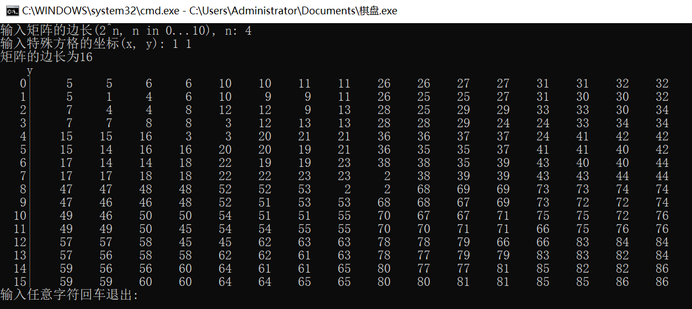

## 二、循环赛日程安排问题

### 2.1 问题描述

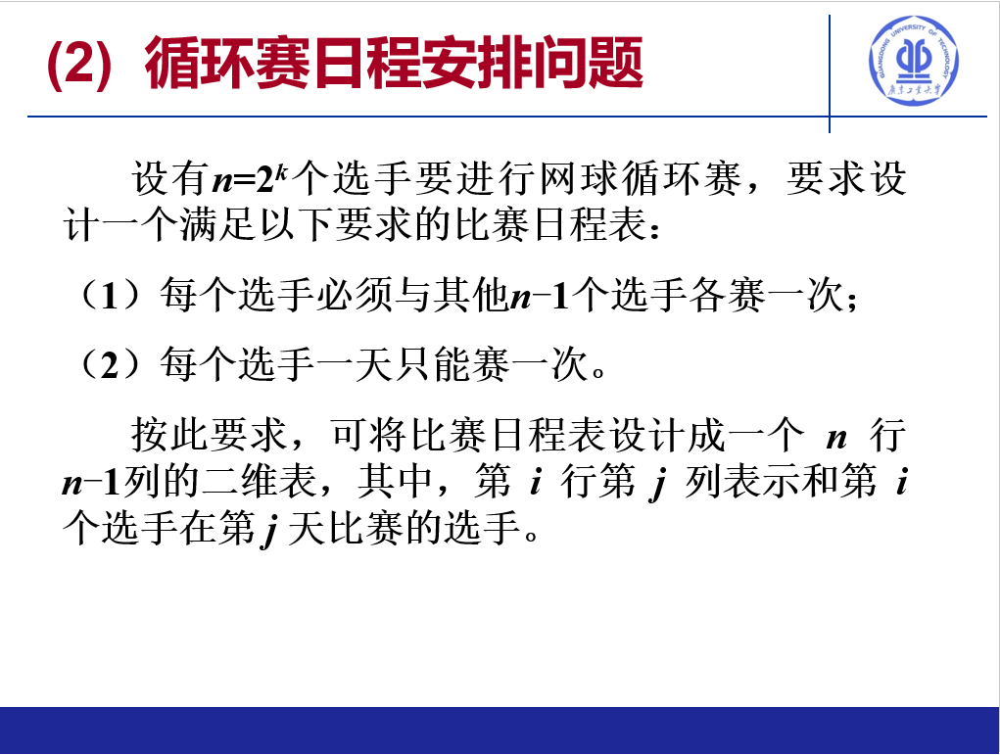

### 2.2 算法思想

​		将比赛日程表设计成一个n行n-1列的二维表，其中，第 i 行第 j 列表示和第 i 个选手在第j 天比赛的选手。 采用分治法，递归为最小为2个选手的子问题。假设输入为n，赛程表为边长为n*n的数组，其中最左边一行就是参赛选手，右边1...n-1行为赛程安排。

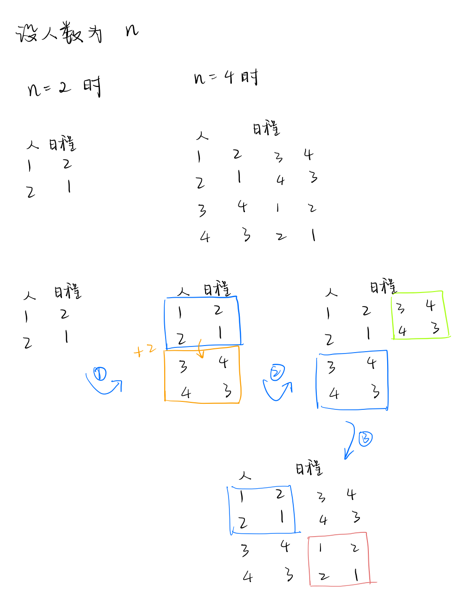

​		采用和棋盘覆盖法相似的思路，但是采用自底向上的方法，先计算出类似左上区，之后步骤如下

1. 将左上区加上二分之n后赋值到左下区
2. 将左下区拷贝到右上区
3. 将左上区拷贝到左下区

### 2.3 实现

```java
public class Main {

    public static void main(String[] args) {

        // 处理用户输入
        int k = -1;
        Scanner sc = new Scanner(System.in);
        while (k == -1) {
            System.out.printf("输入k的值（0<k<=10）: ");
            k = sc.nextInt();
            if (k > 10 || k <= 0) {
                k = -1;
            }
        }
        
        // 转化为参赛选手数量
        int n = 2 << (k - 1);

        System.out.println("参赛选手共" + n + "位");
        int[][] schedule = new int[n][n];
        Map<Integer, Integer> map = new HashMap<>();
            // 初始化最小左上区
            schedule[0][0] = 1;
            schedule[0][1] = 2;
            schedule[1][0] = 2;
            schedule[1][1] = 1;
            
            
            int totalTimesOfExecution = -1, length = schedule.length;
            
            // 计算出算法执行的次数
            while (length > 0) {
                totalTimesOfExecution++;
                length = length >> 1;
            }

            for (int currentTimesOfExecution = 2; currentTimesOfExecution <= totalTimesOfExecution; currentTimesOfExecution++) {
                int currentLength = 1 << currentTimesOfExecution;
                // 计算出半区的长度
                int halfCurrentLength = currentLength >> 1;

                // 由左上区计算出右上区
                for (int i = 0; i < halfCurrentLength; i++) {
                    for (int j = 0; j < halfCurrentLength; j++) {
                        schedule[i + halfCurrentLength][j] = schedule[i][j] + halfCurrentLength;
                    }
                }

                // 拷贝左下区到右上区
                for (int i = 0; i < halfCurrentLength; i++) {
                    for (int j = 0; j < halfCurrentLength; j++) {
                        schedule[i][j + halfCurrentLength] = schedule[i + halfCurrentLength][j];
                    }
                }

                // 拷贝右下区到左上区
                for (int i = 0; i < halfCurrentLength; i++) {
                    for (int j = 0; j < halfCurrentLength; j++) {
                        schedule[i + halfCurrentLength][j + halfCurrentLength] = schedule[i][j];
                    }
                }
            }

            // 输出循环赛结果
            for (int i = 0; i < n; i++) {
                for (int j = 0; j < n; j++) {
                    if (j == 0) {
                        System.out.printf("选手%-6d", i + 1);
                    } else {
                        System.out.printf("% 5d",schedule[i][j]);
                    }

                }
                System.out.println("");
            }

        Scanner scanner = new Scanner(System.in);
        System.out.print("输入任意字符退出: ");
        scanner.next();
    }
}
```

### 2.4 使用说明

1. 输入k的值
2. 查看程序运行结果（如果输入10的时候终端会在窗口内输出一段时间，并不是无法结束的死循环）
3. 输入任意值回车退出

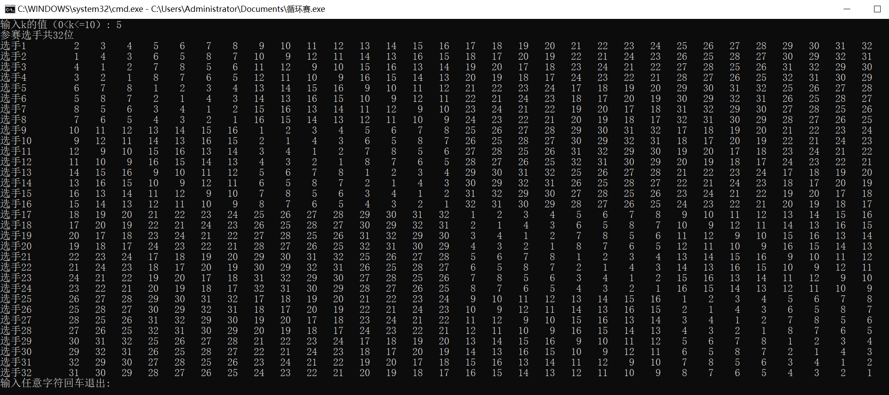

## 三、背包问题

### 3.1 问题描述

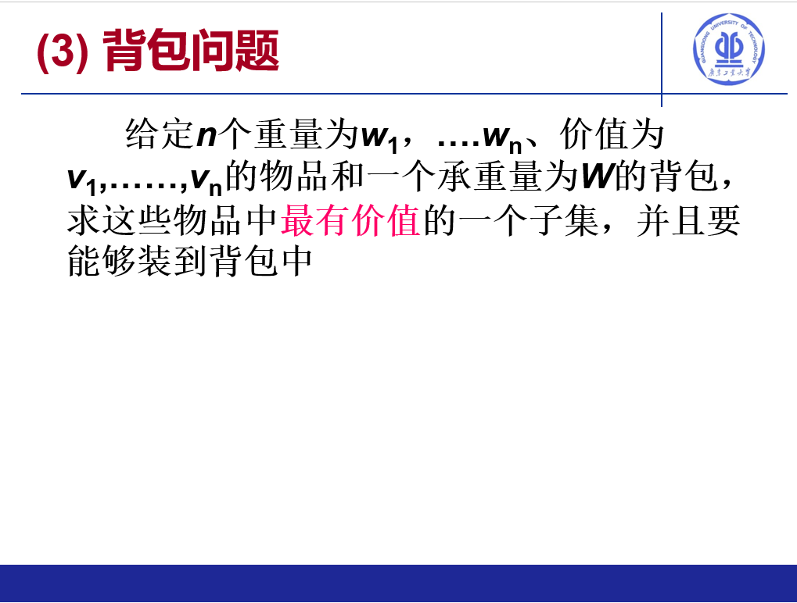

###  3.2 算法思想

​		将多个物品的选择问题分解为容量为j时是否选择第i个物品的子问题，采用动态规划的思想求局部最优解后合并为全局最优解。

### 3.3 实现

```java
public class Main {

    public static void main(String[] args) {
        Scanner sc = new Scanner(System.in);
        System.out.printf("请输入物品的数量: ");
        int numOfLoots = sc.nextInt();

        System.out.print("请输入背包的容量: ");
        int capacity = sc.nextInt();

        int[] values = new int[numOfLoots];
        int[] weights = new int[numOfLoots];
        System.out.printf("请输入各个物品的价值: ");
        for (int i = 0; i < numOfLoots; i++) {
            values[i] = sc.nextInt();
        }
        System.out.printf("请输入各个物品的重量: ");
        for (int i = 0; i < numOfLoots; i++) {
            weights[i] = sc.nextInt();
        }

        int[][] dp = new int[numOfLoots + 1][capacity + 1];

        for (int i = 1; i <= numOfLoots; i++) {
            // 设置变量为当前物品的重量、价值
            int curValue = values[i - 1];
            int curWeight = weights[i - 1];

            for (int j = 1; j <= capacity; j++) {
                if (j >= curWeight) {
                    // 如果容量为j的背包放得下当前物品
                    dp[i][j] = max(dp[i - 1][j], dp[i - 1][j - curWeight] + curValue);
                } else {
                    // 放不下，继承之前的结果
                    dp[i][j] = dp[i - 1][j];
                }
            }
        }

        // 回溯路径
        boolean[] path = new boolean[numOfLoots + 1];
        int availableCapacity = capacity;
        for(int i = numOfLoots; i >= 1; i--) {
            if(dp[i][availableCapacity] > dp[i-1][availableCapacity]) {
                // 放入后价值增加
                path[i] = true;
                availableCapacity -= weights[i-1];
            }
        }

        // 输出
        System.out.print("背包中的货物为: ");
        for (int i = 1; i <= numOfLoots; i++) {
            if (path[i]) {
                System.out.printf("第%d件 ", i);
            }
        }
        System.out.print("\n");
        System.out.println("总价值为: " + dp[numOfLoots][capacity]);
        
        Scanner scanner = new Scanner(System.in);
        System.out.print("输入任意字符回车退出: ");
        scanner.next();
    }
}

```

### 3.4 使用说明

1. 输入物品的数量
2. 输入背包的容量
3. 输入各个物品的价值
4. 输入各个物品的重量
5. 查看输出结果
6. 输入任意字符回车退出

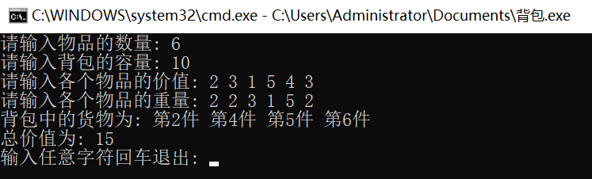

## 四、流水作业调度问题

### 4.1 问题描述

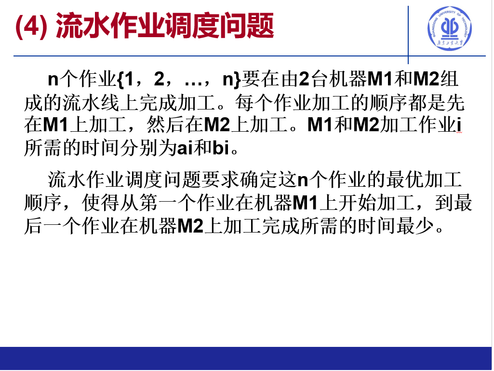

### 4.2 算法思想

​		由Johnson's rule可知，两个工作中心执行任务时存在最佳序列。使用减治法找出最佳序列，具体步骤如下：

1. 如果一个作业的a部分作业量大于b部分作业量且a作业量最大，将其从原作业序列中去除，并放到最佳序列的尾部
2. 如果一个作业的b部分作业量大于a部分作业量且b作业量最大，将其从原作业序列中去除，并放到最佳序列的头部

​		但是这样排序有点抽象，所以我选择了把数组分为前后两部分然后分开排序较为直观，缺点就是处理一个a、b部分工作量相等需要一些调试。得到最佳序列之后采用类似两道批处理系统作业调度的方式模拟打印过程，并计算出结果。

### 4.3 实现

```java
class Job {
    int a;
    int b;
    int id;

    public Job(int a, int b, int id) {
        this.a = a;
        this.b = b;
        this.id = id;

    }
}

public class Main {

    static String log(int m1, int m2) {
        return  "m1: " + m1 + ", m2: " + m2;
    }

    public static void main(String[] args) {
        int jobCount = -1;
        Scanner scanner = new Scanner(System.in);
        while (jobCount < 0 ) {
            System.out.print("请输入作业的个数: ");
            jobCount = scanner.nextInt();
        }

        int partA, partB;
        ArrayList<Job> jobs = new ArrayList<>();
        for (int i = 1; i <= jobCount; i++) {
            System.out.print("输入作业" + i + "的a部分工作量: ");
            partA = scanner.nextInt();
            while (partA < 0) {
                System.out.print("输入作业" + i + "的a部分工作量(大于等于0): ");
                partA = scanner.nextInt();
            }
            System.out.print("输入作业" + i + "的b部分工作量: ");
            partB = scanner.nextInt();
            while (partB < 0) {
                System.out.print("输入作业" + i + "的b部分工作量(大于等于0): ");
                partB = scanner.nextInt();
            }
            // 将作业A、B部分组装成一个作业整体
            jobs.add(new Job(partA, partB, i));
        }

        // 第一部分的作业就是a部分工作量少于b部分工作量，且按a部分工作量升序排序
        ArrayList<Job> firstPartOfJobs = new ArrayList<>();

        // 第二部分的作业就是b部分工作量少于等于a部分工作量，且按b部分工作量升序排序
        ArrayList<Job> secondPartOfJobs = new ArrayList<>();

        for (Job job : jobs) {
            if (job.b > job.a) {
                firstPartOfJobs.add(job);
            } else {
                secondPartOfJobs.add(job);
            }
        }

        // 根据Johnson法则，对b工作量较大的作业按a升序排列
        firstPartOfJobs.sort(Comparator.comparingInt(o -> o.a));
        // 对a工作量大于或等于b工作量的作业按b工作量升序排列，a、b相同的情况放在末尾
        secondPartOfJobs.sort((o1, o2) -> o1.a == o1.b ? -1 : o2.a == o2.b ? -1 : o2.b - o1.b > 0 ? 1 : o2.b - o1.b == 0 ? o2.a - o1.a : -1 ) ;
        ArrayList<Job> sortedJobs = new ArrayList<>();

        // 将两部分排序后合并到新数组，就是最优流水调度
        sortedJobs.addAll(firstPartOfJobs);
        sortedJobs.addAll(secondPartOfJobs);

        // 打印排序后的作业
        for (Job job : sortedJobs) {
            System.out.printf("作业%d ", job.id);
        }

        // 换行
        System.out.print("\n");

        boolean exit = false;
        int consumedTime = 0;
        int m1index = 0, m2index = -1;
        int timeSlice = -1;
        // 让m1先拿到第一个作业的a部分
        int m1 = sortedJobs.get(0).a, m2 = 0;

        // 模拟作业调度过程
        while (!exit) {
            if (m1index > sortedJobs.size() - 1 && m2index > sortedJobs.size() - 1) {
                exit = true;
            }
            timeSlice = m1 > 0 ?
                    (m1index - m2index > 1 && m1 > m2 && m2 > 0? m2 : m1 ) : m2;
            if (timeSlice == 0) {
                break;
            }
            // 打印当前时间片大小
            System.out.println("\n\nCurrent slice: " + timeSlice);

            // 打印当前执行的作业下标，越界下标表示工作已做完
            System.out.println("m1index: "+ m1index + ", m2index: " + m2index);

            // 记录到现在为止消耗的时间
            if (timeSlice != 0) {
                System.out.println(log(m1, m2));
            }
            consumedTime += timeSlice;

            // 模拟在时间片执行作业
            m1 -= timeSlice;
            m2 -= timeSlice;

            // 打印执行后m1、m2的剩余工作时间，负数表示为工作提前完成
            System.out.println("After execution: \n" + log(m1, m2));

            // 如果m1、m2都执行完毕，则m1从排序好的作业中拿到下一个作业的a部分执行
            if (m1 <= 0) {

                    m1index += 1;
                if (m1index < sortedJobs.size()) {
                    m1 = sortedJobs.get(m1index).a;
                }
            }

            // 当m2执行完毕时，此时m1执行结果不影响m2拿到下一个作业执行
            if (m2 <= 0) {
                m2index += 1;
                if (m2index < sortedJobs.size()) {

                    m2 = sortedJobs.get(m2index).b;
                }
            }

            // 打印迄今为止所花费的时间
            System.out.printf("Consumed time so far: %d\n", consumedTime);
        }

        System.out.print("输入任意字符回车退出: ");
        scanner.next();
    }
}
```

### 4.4 使用说明

1. 输入作业的数量
2. 输入每个作业a、b部分的工作量
3. 查看输出结果模拟的调度过程（最后一次花费的时间为总工作时间）
4. 输入任意字符回车退出

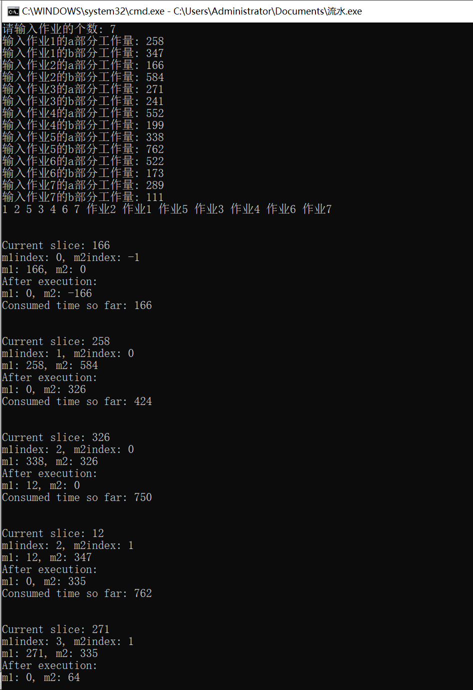

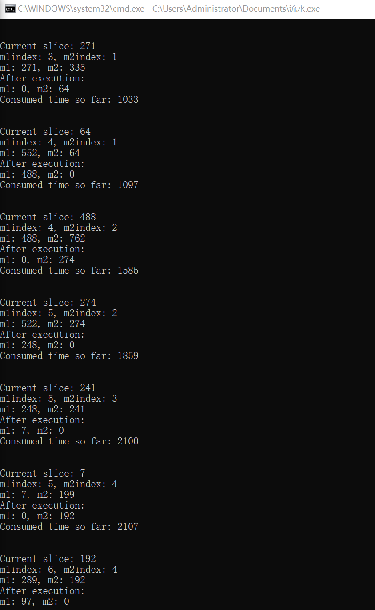

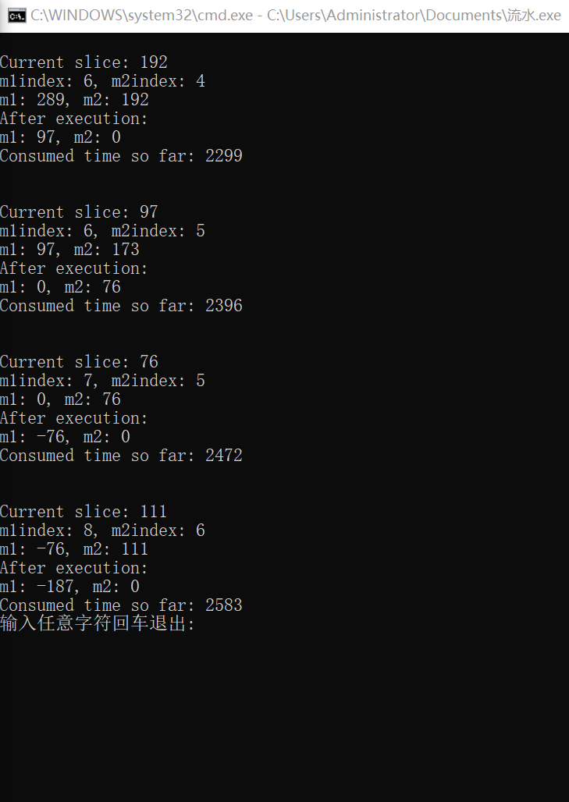